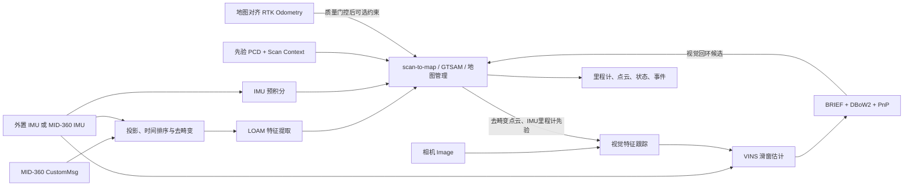

# LVI-SAM-ROS2-Enhanced 技术改进说明

## 摘要

本文面向算法、机器人系统及工程集成领域的第三方评审专家，说明
`LVI-SAM-ROS2-Enhanced` 相对于原始 LVI-SAM/LIO-SAM 数据链及本项目早期 ROS 2 基线的
技术改造、设计边界、接口变化与验证状态。

本项目并非重新设计一种新的激光—视觉—惯性优化理论，而是在保留原有 LOAM 特征提取、
scan-to-map 配准、IMU 预积分、GTSAM 因子图、VINS 滑窗估计以及 BRIEF/DBoW2 视觉回环主体的
前提下，完成以下工程化增强：ROS 2 原生运行组织、Livox MID-360 接入、建图/先验地图定位模式、
Scan Context 全局候选检索、地图持久化、可切换 IMU、外参分层、视觉依赖隔离、RTK 质量门控、
结构化定位状态接口、故障输入隔离及面向 Nav2 的 TF 发布治理。

改造的核心原则是：新增状态与诊断接口不反向控制已有估计器；传感器安装关系全部通过配置
表达；错误输入在优化器之前被拒绝；定位地图只有在完整写入后才能被加载；新增回环候选必须
经过几何一致性验证。

## 1. 评审范围与比较基线

### 1.1 比较对象

本文区分三类基线：

1. **原始 LVI-SAM 架构**：ROS 1 环境下的激光惯性子系统与视觉惯性子系统松耦合方案，视觉
   回环采用 BRIEF/DBoW2；原始实现主要面向在线 SLAM，不提供本项目所需的完整先验地图定位
   工作流。
2. **ROS 2/LIO-SAM 工程基线**：项目早期已经能够运行的 ROS 2 激光惯性实现，包括针对
   MID-360 的局部适配。代码比较锚点为 `6417c63`。
3. **当前增强实现**：功能实现锚点为 `19ca76a`；`f140df2` 将增强实现合入默认 `main`，并
   保留 ROS 环境脚本的 `set -u` 兼容修复。

由于不同公开 fork 的 ROS 2 移植范围并不完全一致，本文所称“新增”是指相对于上述项目基线的
新增或系统化，而非声称相关思想从未在其他开源工程中出现。

### 1.2 不纳入本文结论的内容

- 未声称提出新的 SLAM 优化目标、特征描述子或概率模型；
- 未将当前实机可运行结果等同于具备真值基准的精度评测；
- 未将同一会话内视觉回环等同于跨会话视觉地图重定位；
- 未将 RTK 消息接入等同于完成了所有上游经纬度投影、杆臂和质量解算；
- Nav2 的路径规划、控制器和任务状态机不属于本仓库的算法实现范围。

## 2. 总体架构

当前系统维持 LIS（LiDAR-Inertial System）和 VIS（Visual-Inertial System）松耦合结构：



`mapOptimization` 是地图状态的唯一所有者。视觉回环只提供候选时间对，最终约束仍由激光侧
点云数量、ICP 收敛性及适应度门限验证；状态消息只投影算法当前状态，不拥有或重置估计器。

## 3. 主要技术改进

### 3.1 ROS 2 原生工程化与可裁剪构建

工程统一使用 ROS 2 Humble 的 `rclcpp/rclpy`、组件化 launch、ament/colcon 和标准消息接口。
构建提供 `BUILD_VISUAL=ON|OFF`：纯 LIS 部署不需要生成三个视觉程序；完整模式生成激光侧两个
程序和视觉侧三个程序。GTSAM 接受兼容的 4.x 配置，而不再强制某个完全相等的小版本。

构建脚本能够识别仓库位于 `<workspace>/src` 的部署形式，优先复用机器人工作区已经安装的
`livox_ros_driver2`，避免同一工作区重复发现或重复编译驱动。清理操作限定在 `lvi_sam` 自身的
构建产物，降低对其他机器人软件包的影响。

### 3.2 建图与先验地图定位模式

统一入口 `run.launch.py` 通过 `mode:=mapping|localization` 显式选择模式：

- mapping 创建新的关键帧、点云、Scan Context 描述子和位姿图；
- localization 加载固定先验地图，通过 Scan Context 检索候选，并以局部点云 ICP/scan-to-map
  完成几何验证和连续跟踪；
- 两种模式分别使用 `params_mapping.yaml` 与 `params_localization.yaml`，避免由隐式条件决定
  是否加载地图。

新地图采用事务式保存。建图期间写入 `.lvi_sam_mapping_in_progress`；所有关键帧文件、位姿、
描述子及清单成功写入后才提交 `map_manifest.yaml` 并删除进行中标记。定位模式拒绝缺少关键位姿
文件、清单不一致或仍带进行中标记的地图，从而避免把异常中断或新旧混合目录作为先验地图。

主要地图文件包括：

```text
map_directory/
├── map_manifest.yaml
├── trajectory.pcd
├── transformations.pcd
├── cloudCorner.pcd / cloudSurf.pcd / cloudGlobal.pcd
├── CornerMap/ / SurfMap/ / Scans/
└── SCDs/
```

无 manifest 的历史地图保留兼容读取，但仍执行关键文件、点数和 Scan Context 维度检查。

### 3.3 回环检测与重定位职责分离

当前实现包含两类候选来源：

| 来源 | 作用范围 | 描述子/求解 | 接受条件 |
|---|---|---|---|
| LIS | 同会话回环及跨会话先验地图重定位 | Scan Context 候选 + 点云 ICP | 点云规模、ICP 收敛和适应度门限 |
| VIS | 当前运行会话内视觉回环 | BRIEF/DBoW2 候选 + PnP | 时间同步后仍需 LIS 几何验证 |

视觉数据库目前保存在进程内存中，尚未形成正式的跨会话视觉地图加载功能。工程文档已经定义
`VisualMap/` 的建议数据结构，包括关键帧、描述子、三维地标、内外参和资源版本，但该结构是
后续扩展接口，不应被描述为已完成能力。

### 3.4 MID-360 点云前端与数据有效性保护

Livox `CustomMsg` 转换补齐了边界点处理，并对有限点按 `offset_time` 稳定排序，允许处理包内
点时间轻微乱序。空帧、点数越界、非有限值和无法形成有效扫描的消息会在进入 PCL/GTSAM 前
拒绝并节流告警。特征提取排序区间的末端遗漏得到修正，固定数组和手工资源改为 RAII 容器。

定位及活动建图 profile 的 `mappingProcessInterval` 设置为 `0.0`，表示处理每个已接受雷达帧，
消除 10 Hz 输入在时间戳抖动下被固定 0.1 s 间隔再次抽样的问题。实际输出频率仍受点云规模、
局部地图搜索、ICP 和图优化耗时约束，因此该参数不承诺输出必然等于传感器频率。

### 3.5 IMU profile 与安装外参分层

工程将“传感器标定”和“机器人安装”分为独立配置层：

- `params_imu_external.yaml`：外置 IMU，默认话题 `/IMU_data`；
- `params_imu_mid360.yaml`：MID-360 内置 IMU，默认话题 `/livox/imu`；
- `params_mount_robot.yaml`：机器人 `base_link` 与物理 LiDAR 的安装关系；
- `params_camera*.yaml`：camera—IMU 和 LiDAR—camera 标定。

切换 `imu_source` 会成组切换话题、单位、噪声、姿态来源和 IMU—LiDAR 外参，而不是只替换
话题名。MID-360 原始加速度按 profile 从 `g` 转换到 `m/s²`；无可信姿态观测时，启动倾角来自
`T_base_lidar` 安装标定。内置 IMU 与 LiDAR 的参考平移采用 FAST-LIO MID-360 配置作为初值，
最终精度仍应以本机联合标定为准。

核心估计器不查询 TF tree 推测外参。缺少必要的 IMU—LiDAR、base—LiDAR、camera—IMU 或
LiDAR—camera 参数时，相关链路启动失败，而不是回退为单位矩阵或零平移。这样可避免更换传感器
后因隐式默认值继续运行并产生系统误差。

### 3.6 坐标系、TF 与机器人本体点云过滤

LIS 的地图、轨迹、注册点云和 `/lio_sam/mapping/odometry` 使用
`odometryFrame=odom` 作为估计器世界参考；其物理 child 语义为 LiDAR。融合输出根据配置的
`T_base_lidar` 计算 `odom→base_link`，但该变换不作为估计器输入。

默认不由 mapOptimization 无条件发布多条动态 TF。`publish_fused_tf`、
`publishMappingOdomTF` 和可选静态 `map→odom` 分别控制，以降低与 Nav2、robot_state_publisher
或其他定位源形成重复父节点的风险。VIS 的 `vins_world/vins_body/vins_body_ros` 是视觉内部兼容
坐标，不替代 Nav2 的 `map/odom/base_link` 主链。

机器人本体过滤盒可选择在 `lidar` 或 `base` 坐标系计算：

- `lidar` 模式直接处理原始 LiDAR 点，不受 TF 或所选 IMU 影响；
- `base` 模式只使用 YAML 中的 `T_base_lidar`，不查询运行时 TF。

`/lio_sam/mapping/cloud_registered_raw` 已恢复发布。该话题不是未经处理的 Livox 原始数据，而是
当前扫描经过投影、去畸变、距离/本体过滤后，以当前估计位姿注册到 `odometryFrame` 的高分辨率
点云；它不依赖 RViz 开关，也不再要求已有历史关键帧。

### 3.7 视觉链路兼容与依赖隔离

视觉输入默认支持 `/camera/color/image_raw`。工程增加内部
`sensor_msgs/Image → cv::Mat` 适配层，完成编码、步长、尺寸和数据长度检查，并使每个视觉进程
只链接 CMake 选择的一套 OpenCV，不再直接加载预编译 `cv_bridge`。其目的在于隔离 JetPack
OpenCV 与 ROS Humble OpenCV 并存造成的 ABI 风险，不改变光流、VINS 滑窗或 BRIEF/DBoW2
算法。OpenCV 4 已移除的 `CV_GRAY2RGB` 宏也改为 `cv::COLOR_GRAY2RGB`。

视觉特征、IMU、激光深度和里程计先验的队列增加时间单调性、有限值、容量和退出检查；关闭
视觉或使用 `BUILD_VISUAL=OFF` 时，LIS 可独立运行。LiDAR 深度、LiDAR 里程计先验和在线
camera—LiDAR 对齐为独立开关，未完成标定时不应一次性启用全部耦合路径。

### 3.8 RTK 融合的质量约束

核心接收的 RTK/GNSS 输入是已经投影并与地图对齐的 `nav_msgs/Odometry`，不是原始经纬度。
上游应负责 ENU/地图投影、天线杆臂补偿、RTK 解状态及可信协方差。进入优化或定位初值之前，
数据依次经过：

- 时间戳与有限值检查；
- 期望坐标帧检查；
- 位置/航向协方差门限；
- 绝对创新量和归一化创新量门限；
- 连续稳定帧要求。

建图 GPS 因子可使用 Huber 鲁棒核；定位辅助按协方差降低影响，并只修改扫描匹配初值，最终
结果仍由 scan-to-map 决定。RTK 默认关闭；质量状态、协方差或地图对齐不可靠时不应开启。

### 3.9 结构化定位状态与观察性事件

新增 `lvi_sam_msgs`，提供：

- `/lio_sam/localization/status`：`LocalizationStatus`，包含模式、状态、有效性、数据新鲜度、
  匹配质量、连续成功/失败次数及状态转换序号；
- `/lio_sam/localization/reset`：`LocalizationReset`，记录重定位、图修正及故障事件。

状态包括 `MAPPING`、`RELOCALIZING`、`VERIFYING`、`TRACKING`、`DEGRADED` 和 `LOST`。
上层系统可据此暂停、降级或放行任务，但 LVI-SAM 内部估计器不订阅 reset 事件。状态发布不会
清空 IMU/VIS 队列、重建 GTSAM 图、修改 bias 或重启视觉滑窗。

开发过程中曾验证过“由状态事件直接复位 IMU/VIS”的方案。实机暴露出重定位后有效 IMU 区间
不足、零时长 bias 因子和图时序被改变的风险，因此该联动已撤销。当前保留的零时长预积分保护
属于数值防护，而非状态机控制。这一回退过程构成了当前“状态只观察、不控制”原则的实证依据。

### 3.10 配置治理与启动期校验

运行参数集中在 `src/lvi_sam/config/`。覆盖层级为：场景/mode 配置、IMU profile、机器人安装
profile、相机 profile、显式 launch 覆盖。部署话题和输出目录放在 launch；算法门限、噪声和
标定放在 YAML；C++ 默认值只承担缺参保护。

`lvi_sam_validate_config` 在启动或构建前核对：

- mapping/localization 的共同传感器、帧和扫描参数；
- 外参数组的完整性、旋转正交性与数值范围；
- LIS/VIS 话题和 IMU 语义一致性；
- 词表、BRIEF pattern 和 Scan Context 维度；
- 参数层级错误及必要资源文件。

校验只能证明配置结构和静态契约成立，不能替代外参标定质量或动态数据质量评估。

## 4. 对原算法行为的影响

### 4.1 保持不变的核心计算

- LOAM 类边缘/平面特征定义；
- scan-to-map 残差和迭代优化主体；
- GTSAM 因子图的基本组织；
- IMU 预积分方程和主要噪声模型；
- VINS 滑窗优化的主要因子；
- BRIEF 描述子、DBoW2 检索和 PnP 几何求解主体。

### 4.2 有意改变结果的环节

- 正确应用 IMU—LiDAR、base—LiDAR 和 camera—LiDAR 外参；
- 依据安装标定初始化 MID-360 倾角，使估计器世界系近似水平；
- 修复 Livox 最后点、特征排序末端及点时间乱序处理；
- 定位模式处理每个已接受扫描，而不是按 0.1 s 二次限频；
- 先验地图定位、Scan Context/ICP、回环和可选 RTK 约束。

### 4.3 理论上不应改变正常结果的环节

- 状态和事件消息发布；
- RViz 默认启动及话题可视化；
- 配置文件校验和资源路径检查；
- 队列容量、线程退出、RAII 和非法样本拒绝；
- README、部署脚本和诊断工具。

如果仅启用上述外围功能后轨迹发生系统性变化，应优先审查时间源、实际加载的 YAML、外参方向、
IMU 单位、重复数据发布者和 TF 多发布源，而不能把变化归因于状态消息本身。

## 5. 主要数据接口

| 接口 | 类型 | 方向 | 语义 |
|---|---|---|---|
| `/livox/lidar` | `livox_ros_driver2/msg/CustomMsg` | 输入 | MID-360 原始扫描 |
| `/IMU_data` | `sensor_msgs/msg/Imu` | 输入 | 外置 IMU profile |
| `/livox/imu` | `sensor_msgs/msg/Imu` | 输入 | MID-360 内置 IMU profile |
| `/camera/color/image_raw` | `sensor_msgs/msg/Image` | 输入 | 默认视觉图像 |
| `/gps/lio_sam_odom` | `nav_msgs/msg/Odometry` | 输入 | 已投影、地图对齐且带质量信息的 RTK |
| `/lio_sam/deskew/cloud_deskewed` | `sensor_msgs/msg/PointCloud2` | 输出 | 去畸变点云及 VIS 深度输入 |
| `/lio_sam/mapping/odometry` | `nav_msgs/msg/Odometry` | 输出 | LIS 对外主里程计 |
| `/odometry/imu` | `nav_msgs/msg/Odometry` | 内部输出 | 高频 IMU 传播及 LIS→VIS 兼容先验 |
| `/lio_sam/mapping/cloud_registered` | `sensor_msgs/msg/PointCloud2` | 输出 | 注册特征/地图点云 |
| `/lio_sam/mapping/cloud_registered_raw` | `sensor_msgs/msg/PointCloud2` | 输出 | 注册后的高分辨率当前扫描 |
| `/lvi_sam/vins/loop/match_frame` | `std_msgs/msg/Float64MultiArray` | VIS→LIS | 视觉回环候选时间对 |
| `/lio_sam/localization/status` | `lvi_sam_msgs/msg/LocalizationStatus` | 输出 | 结构化定位状态 |
| `/lio_sam/localization/reset` | `lvi_sam_msgs/msg/LocalizationReset` | 输出 | 观察性定位/图修正事件 |

`/odometry/imu` 的 covariance 前部保留原 LVI-SAM 内部元数据兼容用途，不应被第三方融合器解释为
严格统计协方差；Nav2 和外部定位消费者应优先使用 `/lio_sam/mapping/odometry` 或集成层生成的
标准协方差输出。

## 6. 验证证据与证据边界

当前已完成或已有运行记录支持的项目包括：

- ROS 2 Humble/Orin 上纯 LIS 和完整 VIS 构建；
- 外置 IMU 与 MID-360 内置 IMU 两种 profile 的启动和基础建图；
- 实机雷达约 10 Hz、IMU 约 200/500 Hz 的输入链检查；
- 去畸变点云、注册点云、注册高分辨率点云和主里程计持续发布；
- mapping 输出地图及 localization 加载先验地图的基础流程；
- `BUILD_VISUAL=ON/OFF`、RViz 开关和配置校验；
- OpenCV 4 视觉回环编译兼容及视觉进程不直接依赖 `cv_bridge`；
- 状态事件主动复位方案的回归定位，以及恢复为观察性接口后的代码审阅。

尚不能由现有记录证明的项目包括：

- 使用高精度真值系统得到的绝对/相对轨迹误差统计；
- 跨季节、跨光照、跨天气的大规模重定位成功率；
- 长时间运行的内存、CPU、温度和线程稳定性统计；
- 复杂站场对称结构中的 Scan Context 误闭环率；
- RTK 失锁、周跳和多路径条件下的系统性故障注入结果；
- 跨会话视觉地图重定位，因为该功能尚未正式实现。

因此，对第三方评审而言，当前结论应表述为“功能链和工程接口已经形成并完成基础实机验证”，
而不宜表述为“全部精度、鲁棒性和安全性指标已经完成认证”。

## 7. 建议的第三方验收方法

第三方复核应固定代码提交、配置、地图、bag 和传感器标定版本，并至少执行：

1. **静态测试**：验证姿态、位置和 bias 收敛，统计静止漂移；
2. **重复轨迹测试**：直线、转弯、闭环返回，计算 ATE/RPE 和回环前后跳变量；
3. **双 IMU 对照**：外置 IMU 与内置 IMU 分别使用各自标定，比较轨迹和姿态稳定性；
4. **建图—定位分离测试**：跨进程加载地图，统计初始化时间、成功率和错误候选拒绝率；
5. **退化场景测试**：长直轨道、重复结构、弱纹理、相机遮挡、IMU/点云间歇丢帧；
6. **时间异常测试**：时间回拨、重复发布者、bag 与实机混流，确认非法样本被隔离；
7. **RTK 故障注入**：增大协方差、位置突跳、航向无效和 frame 不一致，确认门控生效；
8. **状态接口验证**：确认状态变化不导致 IMU/VIS 队列、图优化或 bias 被额外重置；
9. **TF 所有权检查**：确认 `map/odom/base_link` 不存在多个发布者和多父节点；
10. **资源测试**：记录 Orin 的 CPU、内存、温度、点云处理耗时和持续运行稳定性。

完整操作命令、配置索引、地图格式和接口契约分别见：

- `docs/USAGE.md`
- `src/lvi_sam/config/README.md`
- `docs/ARCHITECTURE_AND_MAP_FORMAT.md`
- `docs/INTERFACES_AND_STABILITY.md`
- `docs/LOCALIZATION_STATUS_INTERFACE.md`
- `docs/LOCALIZATION_RESET_INTERFACE.md`
- `docs/LOCALIZATION_ACCEPTANCE_MATRIX.md`

## 8. 结论

本项目的主要价值在于把原有可运行但模式、外参、依赖和诊断边界不够清晰的 LVI/LIO 数据链，
整理为可配置、可裁剪、可加载先验地图、可观察定位质量且适合 ROS 2/Nav2 集成的工程实现。
核心优化算法被保留，变化主要集中在输入语义正确性、地图生命周期、跨模块接口、错误隔离和部署
一致性。当前最需要继续量化的不是基础链路能否运行，而是复杂站场下的定位成功率、误闭环率、
长期稳定性、RTK 异常鲁棒性以及未来跨会话视觉地图重定位的有效性。
